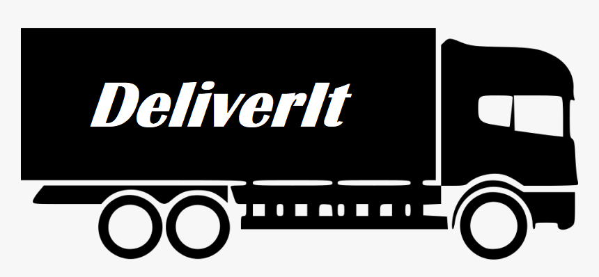

                                    This is done for study purposes!

This is our application which is made user-friendly, so you could place your orders on this platform  
from all over the world. DeliverIT's customers can place orders on international shopping sites
(like Amazon.de or eBay.com) and have their parcels delivered to the company's warehouses. If you want to order
something, and you want it to happen fast without any trouble - you have the right solution which is our application -
DeliverIT.
---
                                                     CITIES
---

**NO AUTHORIZATION NEEDED**

**Get** 
- Route - /api/cities

      All cities method

---

**NO AUTHORIZATION NEEDED**

**Get**

- Route -  /api/cities/cityID

      City by ID

---
                                                     COUNTRIES
---

**NO AUTHORIZATION NEEDED**

**Get**
- Route - /api/countries
  
      All countries method

---

**NO AUTHORIZATION NEEDED**

**Get**

- Route - /api/cities/countryID

      Country by ID

---
                                                     PARCELS
---

**EMPLOYEE OPERATION**

**Get**
- Route - /api/parcels
  
      Returns all customers parcels

---

**EMPLOYEE OPERATION**

**Get**

- Route - /api/parcels/parcelID
  
      Returns customer's concrete parcel.

---

**EMPLOYEE OPERATION**

**Get**

- Route - /api/parcels/sort
  
      Returns sorted parcels by criteria or by multiple criteria (weight and/or date)
      Examples: 
      sort?weight=asc/desc     
      sort?date=asc/desc     
      sort?weight=asc&date=desc

---

**EMPLOYEE OPERATION**

**Get**
- Route - /api/parcels/filter
  
      Returns filtered parcels by criteria or by multiple criteria weight,customer,warehouse,category)
      Examples: 
      filter?weight=20     
      filter?customer=Ivancho    
      filter?warehouse=Bul.Bulgaria 
      filter?category=cloth

---
**EMPLOYEE OPERATION**

**Request Body**

**Post**
- Route - /api/parcels
  
      Creates a parcel.
      Example:
      {
        "weight" : 25,
        "categoryId" :  1,
        "userId" : 12,
        "warehouseId" : 2
      }

---
**EMPLOYEE OPERATION**

**Request Body**

**Put**
- Route - /api/parcels/parcelID
  
      Updates a parcel.
      Example:
      {
        "weight" : 20,
        "categoryId" :  2,
        "userId" : 6,
        "warehouseId" : 1
      }

---
**EMPLOYEE OPERATION**

**Delete**
- Route - /api/parcels/parcelID

      Deletes parcel and removes it from the shipments which the parcel is in.

---
                                                     SHIPMENTS
---

**EMPLOYEE OPERATION**

**Get**
- Route - /api/shipments

      Returns all shipments.

---
**EMPLOYEE OPERATION**

  **Get**
- Route - /api/shipments/shipmentID

       Returns the concrete shipment.
---
**EMPLOYEE OPERATION**

**Request Body**

**Put**
- Route - /api/shipments/{shipmentId}/parcel

       Adding parcel to shipment
       Example: 
       {
        "parcelId" : 1
        }
---
**EMPLOYEE OPERATION**

**Put**
- Route - /api/shipments/{shipmentId}/parcel/{parcelId}

      Removes parcel from concrete shipment.
     

---
**EMPLOYEE OPERATION**

**Get**
- Route - /api/shipments/warehouses/{warehouseId}

      Filters shipments by a concrete warehouse.

---
**EMPLOYEE OPERATION**

**Get**
- Route - /api/shipments/customers/{customerId}

      Filters shipments by a concrete customer.

---
**EMPLOYEE OPERATION**

**Request Body**

**Post**
- Route - /api/shipments

      Creates shipment.
      {
       "departureDate": "2021-10-11",
       "arrivalDate": "2021-11-18",
       "statusId" : 1
       }

---
**EMPLOYEE OPERATION**

**Get**
- Route - /api/shipments/arriving

      Shows the next shipments to arrive.

---
**EMPLOYEE OPERATION**

**Request Body**

**Put**
- Route - /api/shipments/shipmentID

      Updates the concrete shipment.     
      {
      "departureDate": "2021-10-11",
      "arrivalDate": "2021-11-18",
      "statusId" : 1
       }

---
**EMPLOYEE OPERATION**

**Delete**
- Route - /api/shipments/shipmentID

      Deletes the concrete shipment.     

---
                                                     USERS
---

**NO AUTHORIZATION NEEDED**

**Get**
- Route - /api/users/count

      Returns customers count.

---
**EMPLOYEE OPERATION**

**Get**
- Route - /api/users
  
      Returns all users.
---
**EMPLOYEE OPERATION**

**Get**
- Route - /api/users/userID
 
      Returns the concrete user.

---
**EMPLOYEE OPERATION**

**Request Param**

**Get**
- Route - /api/users/search

      Returns filtered parcels by criteria or by multiple criteria email,first name,last name or by one word.
      Examples: 
      full or part of the params.
      search?email=nikolay.georgiev@abv.bg  
      search?firstName=Ivan  
      search?lastName=Petrov
  
      **NOTE**
  
      if word is present, query searches in all three fields.
      Example: search?word=or@gmail.com
      
---
**EMPLOYEE OR CUSTOMER OPERATION**

**Get**
- Route - /api/users/{customerId}/parcels"

      Returns the customer's incoming parcels.
      Every customer can see his own incoming parcels only.

---
**NO AUTHORIZATION NEEDED**

**Request Body**

**Post**
- Route - /api/users

      Creates a new customer.
      Example: 
      {
      "firstName": "Nikolay",
      "lastName": "Citiridis",
      "email": "nikicitiridkata@gmail.com",
      "address": {
        "streetName": "NDKSTREET1",
          "cityId" : 1
         }
      }

---
**EMPLOYEE OPERATION**

**Request Body**

**Put**
- Route - /api/users/{userId}/role

      Adds a role to a concrete customer.
      Example:
      {
      "roleId" : 2
      }

---
**EMPLOYEE OPERATION**

**Request Body**

**Put**
- Route - /api/users/userID

      Updates user.
      Example: 
       {
      "firstName": "Nikolay",
      "lastName": "Citiridis",
      "email": "nikiZvezdata@gmail.com",
      "address": {
        "streetName": "NDKSTREET1",
          "cityId" : 1
         }
      }

---
**EMPLOYEE OR CUSTOMER OPERATION**

**Delete**
- Route - /api/users/usersID

      Deletes the concrete user. User with parcels cannot be deleted.

---
                                                     WAREHOUSES
---

**NO AUTHORIZATION NEEDED**

**Get**
- Route - /api/warehouses

      Returns all warehouses.

---
**EMPLOYEE OPERATION**

**Get**
- Route - /api/warehouses/warehouseID

      Returns the concrete warehouse.

---
**EMPLOYEE OPERATION**

**Request Body**

**Post**
- Route - /api/warehouses

      Creates a new warehouse.
      Example: 
      {
         "address": {
         "streetName": "Bul.KuklenskoShose3",
         "cityId" : 10
         }
      }

---
**EMPLOYEE OPERATION**

**Post**
- Route - /api/warehouses/warehouseID

      Updates the concrete warehouse.
      Example: 
      {
         "address": {
         "streetName": "TsarigradskoShose5",
         "cityId" : 1
         }
      }

---
**EMPLOYEE OPERATION**

**Delete**
- Route - /api/warehouses/warehouse/ID

      Deletes the concrete warehouse. Warehouse with parcels in it cannot be deleted.

